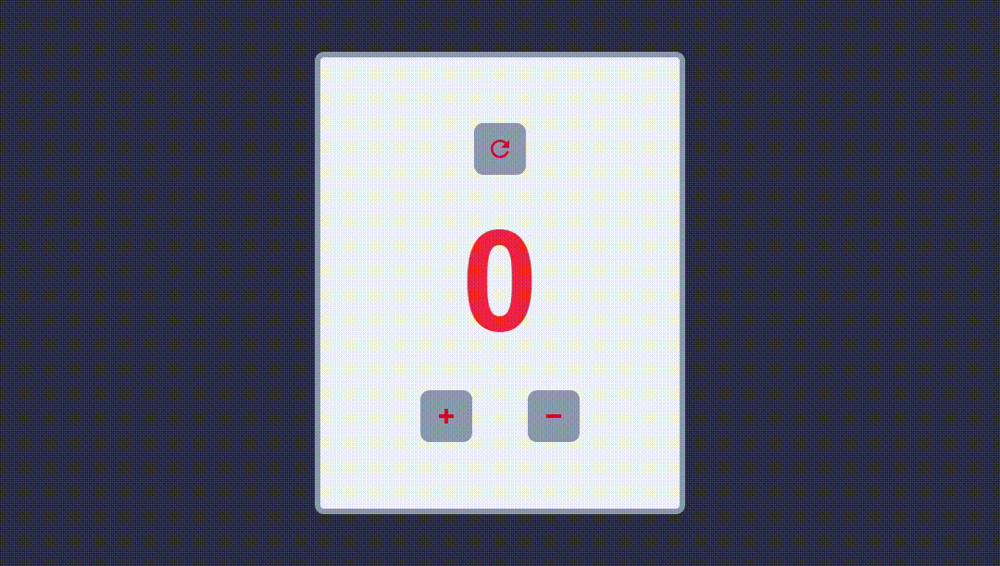

# React Counter App

## 📄 Sobre


### Uma aplicação simples feita em React. Trata-se de um contador onde é possível aumentar, diminuir e reiniciar a contagem. 

<br>



<br>

## 🔗 Link

### Você pode acessar e testar  [clicando aqui](https://gabriel-santana.github.io/react-counter-app/).

<br>

## 🐙 Como baixar o projeto

```bash
# Clonar o repositório
$ git clone https://github.com/gabriel-santana/react-counter-app.git

# Entrar no diretório
$ cd react-counter-app

# Instalar as dependências
$ yarn install

# Iniciar o projeto
$ yarn start

```